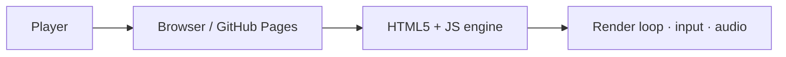

<div align="center">

# operation-blackout

### Operation Blackout — a fast browser FPS.

[](https://cognis-digital.github.io/operation-blackout/)
[](LICENSE)

**▶ Play instantly: https://cognis-digital.github.io/operation-blackout/**  · no install, runs in any modern browser.

</div>

## What is this?

Operation Blackout is a free first-person shooter game you play directly in your web browser — no download or install needed. You take on the role of a soldier completing tactical missions against AI enemies across 3D combat environments, choosing your loadout, difficulty level, and how aggressively the enemy behaves. As you play, you earn XP and money to level up your rank and unlock better gear. It is made for anyone who wants a quick, no-fuss action game they can jump into from any modern browser.

## Getting started

**Play online (no setup required):**

Open [https://cognis-digital.github.io/operation-blackout/](https://cognis-digital.github.io/operation-blackout/) in any modern browser (Chrome, Firefox, Edge, Safari). No account, no install, no plugins needed.

**Run locally:**

```bash
git clone https://github.com/cognis-digital/operation-blackout.git
cd operation-blackout
python -m http.server 8000
# then open http://localhost:8000 in your browser
```

## About
Operation Blackout — a fast browser FPS. Built as a self-contained browser experience (HTML5 + JS canvas/WebGL). Part of the [Cognis Digital](https://cognis.digital) labs.



<a name="verification"></a>
## Verification

Every push is verified end-to-end. Latest audit (2026-06-13):

```text
tests        : 0 passed, 0 failed, 0 errored
compile      : all modules parse
cli          : n/a
package      : n/a
```

<details><summary>CLI surface (<code>--help</code>)</summary>

```text
(see --help)
```
</details>

Full machine-readable results: [`AUDIT.md`](AUDIT.md) · regenerate with `python -m operation-blackout --help` + `pytest -q`.

<div align="right"><a href="#top">↑ back to top</a></div>


## License
COCL v1.0 — see [LICENSE](LICENSE).

<!-- cognis:domains:start -->
## Domains

**Primary domain:** Defense & Aerospace  ·  **JTF MERIDIAN division:** IRONCLAD · INDIA

**Topics:** `cognis` `defense` `aerospace` `defense-tech`

Part of the **Cognis Neural Suite** — 300+ source-available tools organized across 12 domains under the JTF MERIDIAN command structure. See the [suite on GitHub](https://github.com/cognis-digital) and [jtf-meridian](https://github.com/cognis-digital/jtf-meridian) for how the pieces fit together.
<!-- cognis:domains:end -->
